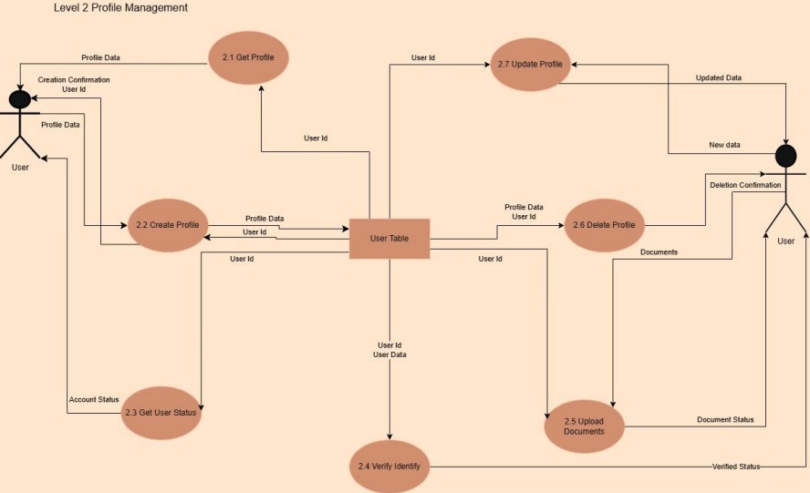

# Car Sales System Design

This repository contains the design artifacts of a **Car Sales Software Project**.  
It demonstrates the system’s architecture,interface definitions, class diagrams, sequence diagrams and dataflow diagrams.

The images below are **samples of the work**.  
The full design and all diagrams are available in the PDF file linked for download.

---

## Sample Diagrams

### Architecture Overview

**Arch 0**
  
 
**Arch 1**
  
 
---

### Logic & Processes
  

  
**Mange_Feedback seq**

**Profile_Management_DFD** 
  

---

## Full Project Design

Download the full design document (PDF) with all diagrams and explanations here:  

[**Car-Sales System Full PDF**](https://github.com/Basmala-ElKady/Car-Sales-System-Design/blob/main/Car-Sales%20System.pdf)

---

## How to Use
  Clone this repository:  
   `git clone https://github.com/Basmala-ElKady/Car-Sales-System-Design.git`

---
## Authors
- [Basmala ElKady](https://github.com/Basmala-ElKady)
- [Menna Hossny](https://github.com/Mennatullah122)
- [Hoda Mahmoud](https://github.com/HodaMahmoud-2005)
- [Hany Ziad](https://github.com/hanyzead123)
- [Mohamed Mosad](https://github.com/MosadCreates)
